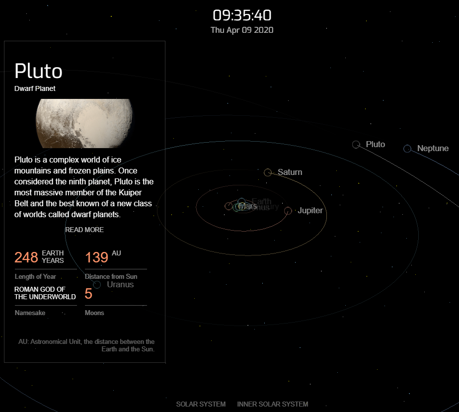

# solarsystem

solar-system is a clone of nasa's 3D solar system model, which display the real-time position of the planets of the solar system. it is based on vanilla javascript dom. 

live: https://uranussg.github.io/solarsystem/

* 3d model: utilized orbit control to realize reaction to dragging and zooming mouse actions.

* on-time position and orbit: The 3D model display the gradually transparent orbits of each planet, and their relavent position based on the real data.

* randomized starfield: used approperate distance parameters and distribution function to gemerated a starfield that are actually consisted of 3d models.

* planets' name in JavaScript Dom: utilized projection method in three.js to get the screen coordinates from the 3d matrices, thus added the texts that are able to attach to the planets.

* detail-panel: display detail panels in react to mouse's click on each planets. added fade-in/out effect to it.

* sun model: display a rotating sun model that reflect the real-sun's size when zoom in closely enough.


# SolarSystem
A clone of nasa's 3D solar system model

## Table of contents
* [General info](#general-info)
* [Screenshots](#screenshots)
* [Technologies](#technologies)
* [Features](#features)
* [Status](#status)
* [Contact](#contact)

## General info
SolarSystem is a clone of nasa's 3D solar system model, which display the real-time position of the planets of the solar system. it is based on vanilla javascript dom. 

live: https://uranussg.github.io/solarsystem/


## Screenshots


## Technologies
* Three.js
* Vanilla JavaScipt Dom

## Code Examples
Add html element to 3D canvas:
```
if( document.getElementById(planetName) )
    {text = document.getElementById(planetName) }
else {
    text = document.createElement('div')
    text.classList.add('text')
    text.setAttribute('id', planetName)
    container.appendChild(text)
    text.style.position = 'absolute';
    text.innerHTML = planetName;
    text.style.background = "transparent";
}
text.style.display = 'block'

if(Math.abs(vector.x) < 0.07 && Math.abs(vector.y) < 0.07) {
    text.style.opacity = Math.sqrt(vector.x ** 2 + vector.y ** 2) * 8
}
else {
    text.style.opacity = 0.8
}

text.style.left = x + 'px';
text.style.top = y + 'px';
```

## Features

* 3d model: utilized orbit control to realize reaction to dragging and zooming mouse actions.

* on-time position and orbit: The 3D model display the gradually transparent orbits of each planet, and their relavent position based on the real data.

* randomized starfield: used approperate distance parameters and distribution function to gemerated a starfield that are actually consisted of 3d models.

* planets' name in JavaScript Dom: utilized projection method in three.js to get the screen coordinates from the 3d matrices, thus added the texts that are able to attach to the planets.

* detail-panel: display detail panels in react to mouse's click on each planets. added fade-in/out effect to it.

* sun model: display a rotating sun model that reflect the real-sun's size when zoom in closely enough.


## Status
Project is: _finished_


## Contact
Created by [@uranussg](https://uranussg.github.io/portfolio/) - feel free to contact me!
